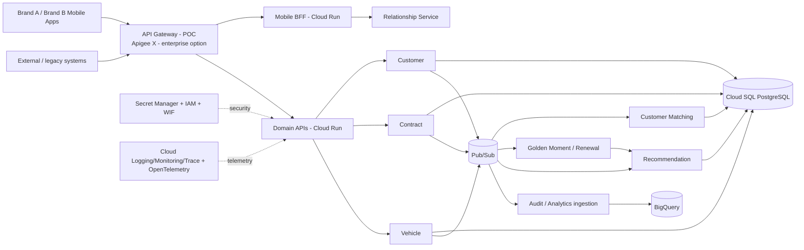

# Maya Automotive Financial Services — GCP Event-Driven Architecture

> Synthetic reference architecture for an automotive financial-services company. All business data, identities, vehicles and contracts are synthetic. This repository is not the architecture of Renault, Mobilize Financial Services, RCI Banque or any other real company.

## Target mission

**Architecte Technique GCP / Event Driven — Financial Services — Paris**

Public market signal checked on 2026-09-15: CAT-AMANIA published a freelance mission on 2026-09-09 for a 12-month renewable engagement in Paris, hybrid, at 550–600 EUR/day. The mission asks for GCP solution architecture, HLD/LLD, customer matching/data quality, contract integration through APIs/SI, recommendation/data use, microservices and event-driven patterns.

This POC converts those requirements into an evidence-driven architecture program:

`Business need -> Domain -> HLD/LLD -> APIs -> Events -> Services -> GCP -> Security -> IaC -> CI/CD -> Observability -> Resilience -> Evidence -> Architecture Board`

## Business scenario

The target is a **Digital Financial Relationship Hub** for a fictional automotive financial-services company. A customer can see a consolidated relationship covering identity, vehicles, finance/lease/service/insurance contracts, installments, renewals, recommendations and interactions.

Core capabilities:

- Customer identity and deterministic customer matching;
- Vehicle and contract aggregation;
- Customer Relationship Hub and Mobile BFF;
- Golden Moments and renewal opportunities;
- Rule-based recommendation engine;
- Synthetic residual-value calculation;
- Event-driven integration and audit;
- Analytics on contracts, events and recommendations.

## Target architecture



Cloud Run is the MVP compute baseline; Pub/Sub is the event backbone. Eventarc is introduced only for Google Cloud event routing where it adds value. GKE remains an ADR alternative for workloads that need stronger platform control, service mesh, scheduling or long-running characteristics.

## Evidence-first maturity

| Area | Current status |
|---|---|
| Offer/program research | DESIGNED |
| Business/domain architecture | DESIGNED |
| HLD / target architecture | DESIGNED |
| Java services | NOT_STARTED |
| OpenAPI / AsyncAPI | NOT_STARTED |
| Terraform | NOT_STARTED |
| GCP runtime | NOT_VALIDATED |
| Retry / DLQ / replay / idempotency | NOT_STARTED in this repository |
| Observability / tracing | NOT_STARTED |
| Performance / FinOps measurements | NOT_MEASURED |

`DESIGNED` means architecture material exists. It does not mean the runtime has been implemented or validated.

## Demo target

```text
External Contract System
 -> Contract API
 -> ContractCreated
 -> Pub/Sub
 -> Customer Matching
 -> CustomerMatched
 -> Relationship Hub
 -> Golden Moment Detection
 -> Recommendation Engine
 -> RenewalRecommendationGenerated
 -> Mobile BFF
```

The final demonstration must also show duplicate-event handling, idempotency, invalid-event retry, DLQ, controlled replay and an end-to-end correlated trace.

## Start here

- [Backlog and iterations](BACKLOG.md)
- [Portfolio summary](PORTFOLIO.md)
- [Job offer analysis](docs/job-offer/JOB_OFFER_ANALYSIS.md)
- [Requirements traceability](docs/job-offer/JOB_REQUIREMENTS_TRACEABILITY.md)
- [Business domain](docs/domain/BUSINESS_DOMAIN.md)
- [Bounded contexts](docs/domain/BOUNDED_CONTEXTS.md)
- [Domain event map](docs/domain/DOMAIN_EVENT_MAP.md)
- [HLD](docs/architecture/HLD.md)
- [Target architecture](docs/architecture/TARGET_ARCHITECTURE.md)
- [NFR](docs/architecture/NFR.md)
- [Public repository benchmark](docs/research/PUBLIC_REPOSITORY_BENCHMARK.md)
- [Internal reuse analysis](docs/research/INTERNAL_REUSE_ANALYSIS.md)
- [Official/public sources](docs/research/OFFICIAL_SOURCES.md)

## Truth rules

Never claim `production ready`, `validated`, `HA tested`, `secure`, `high performance` or `scalable` without evidence. Runtime statuses must distinguish design, implementation, static validation, local validation, GCP validation and measurement.

No static GCP service-account key belongs in Git. GitHub-to-GCP authentication will use Workload Identity Federation/OIDC when the runtime phase starts.
