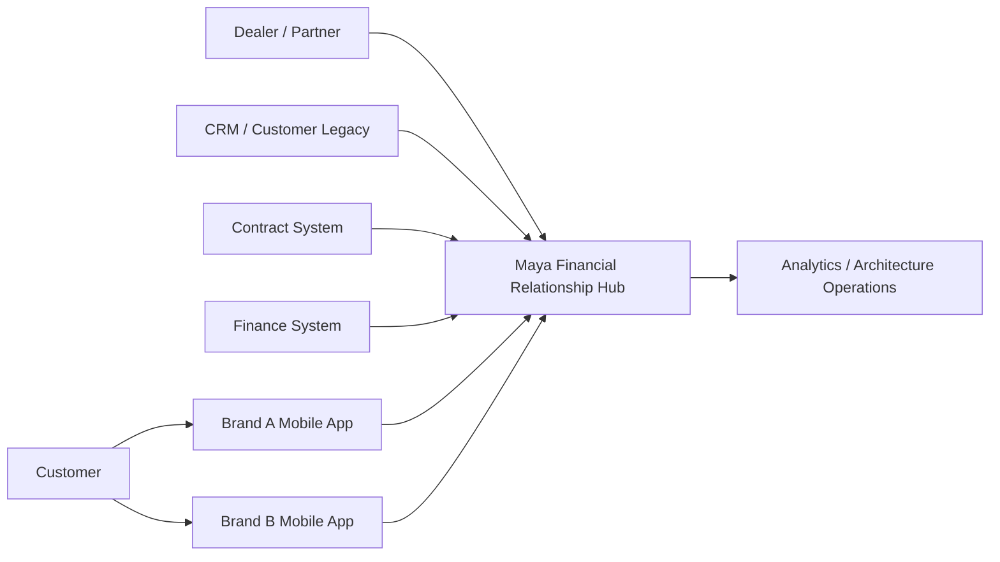
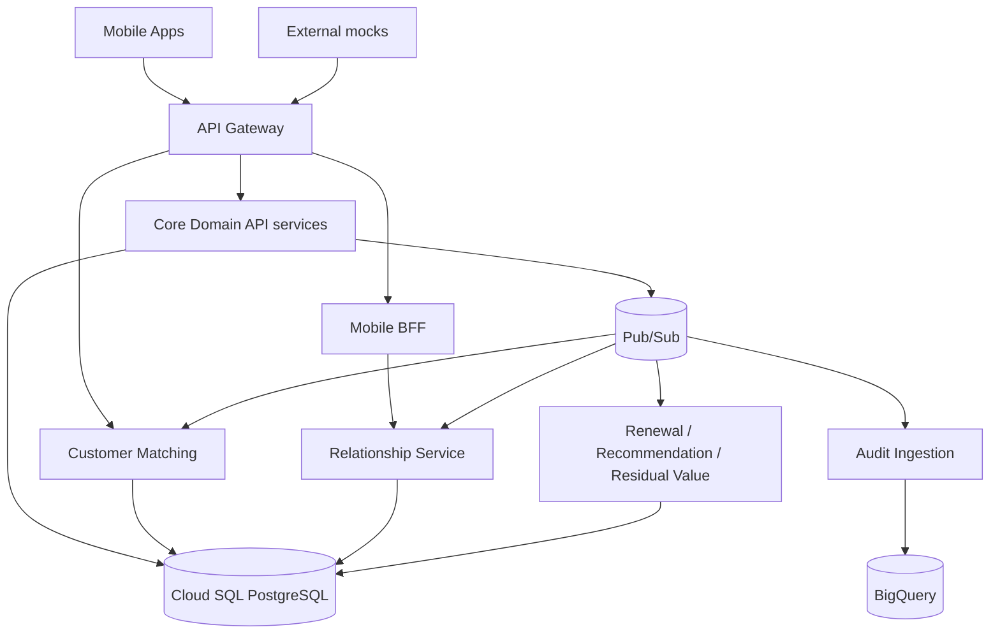
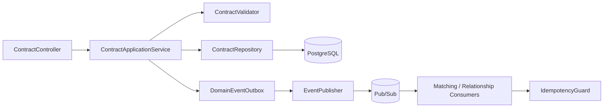
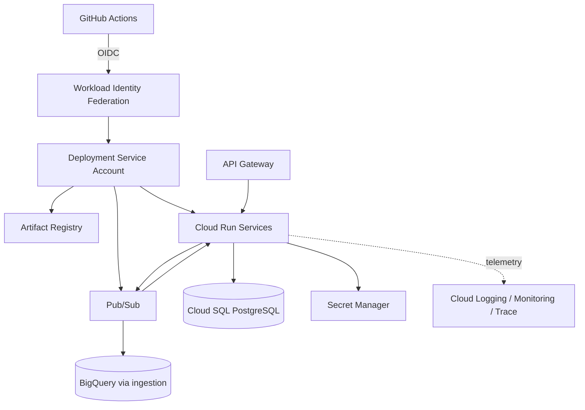

# C4 Architecture Views

Status: `DESIGNED`.

## C1 — System Context

The Hub consolidates synthetic customer/vehicle/contract data, reconciles identities, detects renewal context and serves relationship/recommendation views.

## C2 — Containers

Logical deployables may initially be consolidated. A bounded context is not automatically one runtime service.

## C3 — Contract processing vertical slice

Implementation may use an outbox or an equivalent transactionally safe publication strategy; ADR will be added when code reaches I5/I13.

## Deployment view

No deployment shown here is claimed as executed yet.
