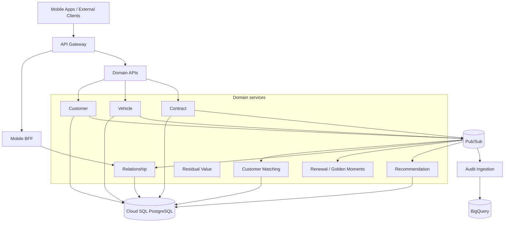

# High-Level Design — Baseline

Status: **DESIGNED baseline**. This HLD is intentionally created early and will be hardened during I2/I16. No GCP runtime validation is implied.

## 1. Executive summary

Maya Automotive Financial Services is a synthetic GCP event-driven platform that consolidates customer/vehicle/contract information, performs explainable customer matching, derives contextual renewal moments and recommendations, and exposes a mobile-oriented relationship view.

The MVP favors managed/serverless GCP services to reduce lab operational overhead while preserving architecture decisions that explain when GKE/Kafka/Apigee would be more appropriate.

## 2. Architecture drivers

- public mission requirement for GCP, HLD/LLD, matching/data quality, APIs, microservices and event-driven patterns;
- correlated program signals around contract visibility, Golden Moments, recommendation and two mobile applications;
- low-cost demonstrable lab;
- evidence-first reliability and security;
- simple teardown and bounded cloud spend.

## 3. Logical architecture

## 4. Physical GCP baseline

| Concern | MVP service | Rationale / alternative |
|---|---|---|
| Container compute | Cloud Run | managed/serverless, economical POC; GKE evaluated by ADR |
| Messaging | Pub/Sub | managed event backbone; Kafka evaluated by ADR |
| Google-event routing | Eventarc selectively | use only where provider->target routing adds value |
| Transactional relational state | Cloud SQL PostgreSQL | relational model and familiar transaction semantics |
| Analytics | BigQuery | analytical/event queries separated from OLTP |
| API front door | API Gateway initially | economical POC; Apigee X as enterprise option |
| Secrets | Secret Manager | externalize runtime secrets |
| Images | Artifact Registry | container artifact source |
| CI identity | Workload Identity Federation | GitHub OIDC; no static service-account keys |
| Telemetry | Cloud Logging/Monitoring/Trace + OpenTelemetry | correlated logs/metrics/traces |
| IaC | Terraform | reproducible disposable environment |

## 5. Integration

### Synchronous

REST APIs are used where callers require an immediate response: customer/contract creation, matching evaluation, relationship/mobile reads.

### Asynchronous

Pub/Sub propagates business facts to matching, relationship projections, Golden Moment/renewal rules, recommendation and analytics. Consumers are designed for redelivery and duplicates.

Eventarc is not the universal backbone. It is reserved for routing Google Cloud events when that reduces bespoke plumbing.

## 6. Data architecture

- Domain services own transactional state and schemas.
- Relationship is a read projection, not the canonical system of record.
- BigQuery receives analytical/event projections, not direct ownership of transactional commands.
- PII in the POC is synthetic.
- Data quality indicators include match decision distribution, missing source identifiers and rejected/invalid contracts.

## 7. Security baseline

- least-privilege service accounts per deployable/service group;
- authenticated Cloud Run service-to-service calls where synchronous internal HTTP is used;
- GitHub -> GCP through WIF/OIDC;
- secrets in Secret Manager, never committed;
- TLS in transit and provider-managed encryption at rest as baseline, with additional controls reviewed by ADR/threat model;
- structured audit/security logs;
- CI supply-chain scanning/signing policy to be defined in I10/I11.

`DESIGNED` does not equal security validation.

## 8. Availability and resilience

Design mechanisms:

- Cloud Run autoscaling and revision model;
- Pub/Sub retry/dead-letter strategy;
- idempotent consumers;
- timeouts and bounded retries for synchronous calls;
- database failure handling;
- replay runbooks;
- stateless services where possible.

Actual RTO/RPO, availability and failure behavior remain unmeasured until runtime tests.

## 9. Observability

Every request/event path should carry:

`correlationId`, `eventId`, `eventType`, `aggregateId`, service, environment, duration and outcome.

OpenTelemetry is the instrumentation baseline. The final demonstration must correlate the mobile/API path through relationship/contract/event/recommendation processing.

## 10. Transition architecture

1. Local/static implementation and tests.
2. Terraform dev environment with budget guardrails.
3. Deploy smallest Cloud Run + Pub/Sub + Cloud SQL slice.
4. Add relationship/matching/recommendation.
5. Add resilience and telemetry evidence.
6. Add BigQuery analytics.
7. Evaluate enterprise deltas: Apigee, GKE, multi-region, advanced data processing.

## 11. Main risks

| Risk | Treatment |
|---|---|
| Over-engineering too many microservices | combine deployment units while retaining domain boundaries |
| Cloud cost | scale-to-zero where applicable, budget alerts, `make destroy` |
| Duplicate/out-of-order events | event IDs, versions, idempotency, replay policy |
| Matching false positives | deterministic explainable rules and `REVIEW_REQUIRED` |
| Coupled mobile model | BFF + stable domain APIs/events |
| Unproven HA/performance | explicit `NOT_VALIDATED/NOT_MEASURED` until evidence exists |
