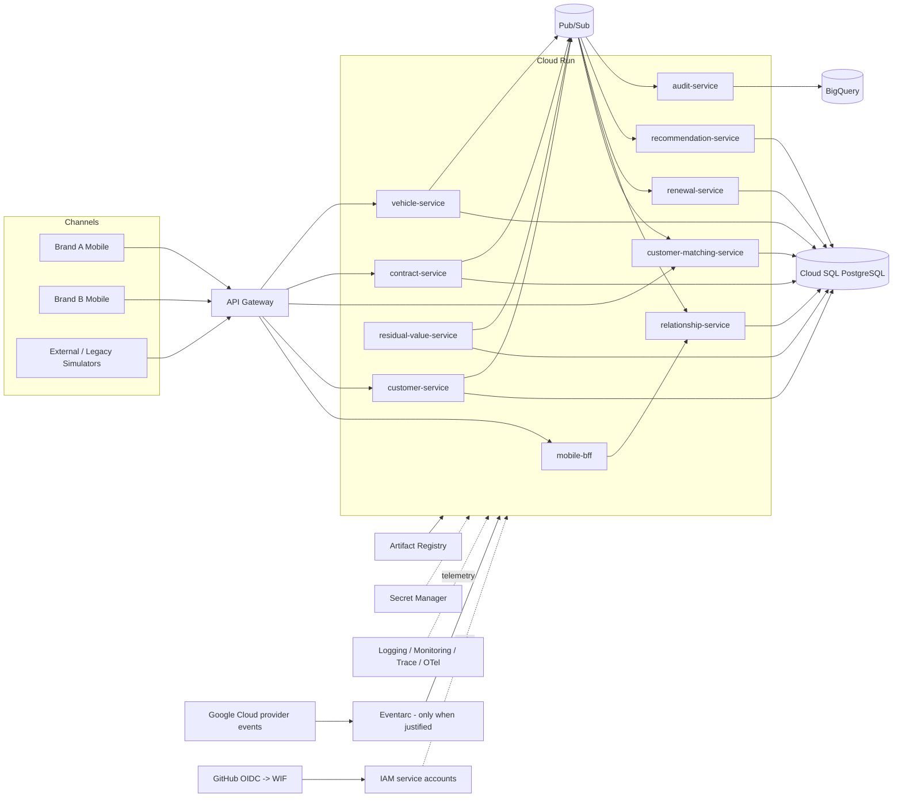

# Target Architecture — GCP Event-Driven Financial Relationship Hub

Status: **DESIGNED**.

## Target view

## Service-deployment strategy

The diagram shows logical candidate services. The first executable MVP may consolidate services to reduce operational noise. A service earns a separate deployment when it needs independent scaling, security, lifecycle, ownership or failure isolation.

## Pub/Sub topology principles

Topic names will follow a domain/version convention rather than one topic per Java class. Initial candidate families:

- `customer-events-v1`
- `vehicle-events-v1`
- `contract-events-v1`
- `engagement-events-v1`
- `audit-events-v1`

Subscriptions are consumer-owned. DLQ topics/subscriptions are defined per reliability requirement. Final topology belongs to I5/I9 and must be validated against quotas/cost/operability.

## Cloud Run vs GKE

Cloud Run is the MVP default because the POC values low operational overhead and disposable cost. GKE becomes preferable if later requirements need strong cluster/platform control, complex service mesh, specialized scheduling, daemon workloads, advanced networking or workloads unsuitable for the Cloud Run execution model.

No claim is made that Cloud Run is universally superior.

## Pub/Sub vs Kafka

Pub/Sub is the POC default because the requirement is GCP-centric and the lab benefits from a managed event service. Kafka remains an alternative when portable streaming semantics, larger replay/retention control, Kafka ecosystem integration or existing organizational platform standards dominate.

This decision will be formalized in ADR-001.

## API Gateway vs Apigee

API Gateway is the economic MVP baseline. Apigee X is the enterprise candidate when the architecture requires richer API product management, developer portal, advanced policies, monetization/partner management or enterprise API governance.

## Data stores

- **Cloud SQL PostgreSQL**: transactional domain state.
- **BigQuery**: analytical/event projection.
- **Firestore**: not selected without a concrete document/key-value access need.
- **Cloud Storage**: optional bulk/raw artifacts/evidence or data-exchange landing zone where justified.

## Security zones

1. Public/channel ingress through managed API front door.
2. Authenticated service identities for internal workloads.
3. Data services with narrowly scoped access.
4. CI/CD identity federated from GitHub, with repository/ref/attribute restrictions to be defined.
5. No long-lived GCP key committed to the repository.

## Multi-region

Multi-region is a **target architecture study**, not an MVP runtime promise. The final strategy depends on business RTO/RPO, Cloud SQL topology, event/data regional requirements, API routing, cost and operational complexity. It will be documented by ADR and only marked validated after an actual exercise.
