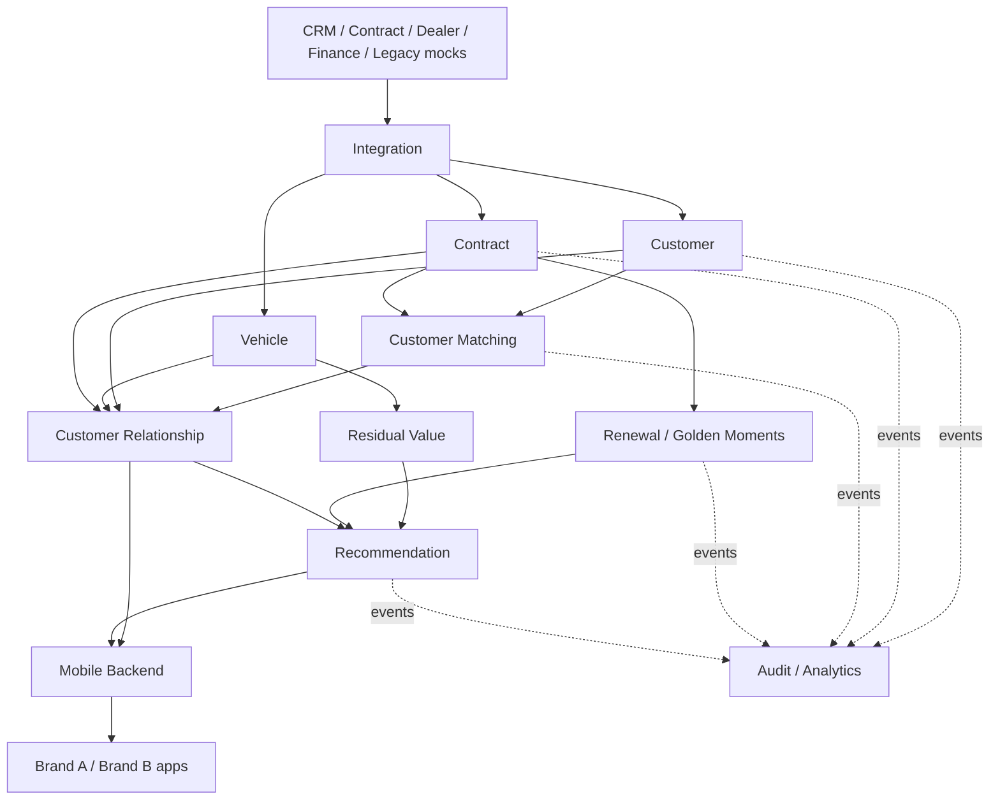

# Bounded Contexts

## Context catalog

| Context | Responsibility | Main data/aggregate | Primary APIs | Produced events |
|---|---|---|---|---|
| Customer | canonical synthetic customer identity/contact/references | Customer | `POST/GET /customers` | CustomerCreated, CustomerUpdated |
| Customer Matching | reconcile identities from multiple systems | MatchRequest/MatchDecision | `POST /matching/evaluate` | CustomerMatched, CustomerMatchReviewRequired |
| Vehicle | vehicle reference/lifecycle | Vehicle | `GET /vehicles/{id}` | VehicleRegistered, VehicleUpdated |
| Contract | contract lifecycle and customer/vehicle links | Contract | `POST /contracts`, `GET /contracts/{id}`, customer contracts | ContractCreated/Updated/Activated/EndApproaching/Closed |
| Finance | synthetic schedule/financing attributes | Schedule/Financing | internal/API later | PaymentScheduleUpdated |
| Residual Value | synthetic residual calculation | ResidualValue | `GET /vehicles/{id}/residual-value` | ResidualValueCalculated |
| Customer Relationship | read-optimized consolidated relationship | RelationshipProjection | `GET /customers/{id}/relationship` | CustomerRelationshipUpdated |
| Renewal | Golden Moments and renewal opportunities | GoldenMoment/RenewalOpportunity | query/admin later | GoldenMomentDetected, RenewalOpportunityDetected |
| Recommendation | deterministic next-best actions | Recommendation | customer recommendations | RecommendationGenerated/Viewed/Accepted/Rejected |
| Notification | brand-neutral notification request orchestration | NotificationRequest | internal | NotificationRequested |
| Mobile Backend | channel-oriented financial self-care BFF | Session/View DTOs | `/me/*` | interaction events |
| Integration | adapters/canonicalization for simulated external systems | adapter state | inbound APIs/files later | canonical domain commands/events |
| Audit | immutable-ish audit/event projection for demo and analytics | AuditEvent | query later | analytics sink only |

## Context interaction principles

1. Each context owns its transactional data; direct cross-context table access is forbidden.
2. Synchronous calls are used when the caller needs an immediate answer to complete the request.
3. Domain propagation, projections and downstream reactions prefer events.
4. Event consumers must assume redelivery and implement business idempotency.
5. The Relationship context is a projection/read model, not the canonical owner of Customer or Contract.
6. Recommendation rules consume stable facts/events; they do not mutate Contract state directly.
7. The Mobile BFF composes channel views but must not become a hidden domain monolith.

## Context map

## Customer Matching anti-corruption role

Multiple external systems may represent the same person differently. Matching therefore sits behind normalized source adapters and creates explicit decisions instead of leaking external identity semantics into every context.

Decision vocabulary:

- `MATCHED`
- `REVIEW_REQUIRED`
- `NO_MATCH`

Every decision retains score/rules/source metadata needed for testability and explanation.

## Service decomposition guardrail

The bounded-context map is not a mandate for one deployable per box. The first executable vertical slice may combine low-value boundaries if that materially reduces POC complexity. Architecture boundaries must remain explicit in code/packages/contracts even when deployment units are consolidated.
