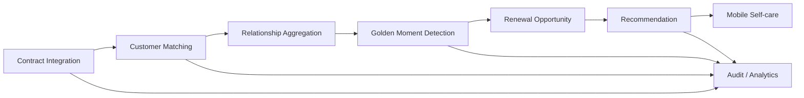

# Business Capability Map

## Customer & Relationship

| Capability | Priority | Owning context | Evidence target |
|---|---:|---|---|
| Customer identity | P0 | Customer | API/tests |
| External reference management | P0 | Customer | API/tests |
| Customer matching | P0 | Customer Matching | rules + evidence |
| Relationship aggregation | P0 | Customer Relationship | projection/E2E |
| Interaction history | P1 | Audit / Relationship | events/query |

## Vehicle & Contracts

| Capability | Priority | Owning context | Evidence target |
|---|---:|---|---|
| Vehicle reference | P0 | Vehicle | API/tests |
| Contract lifecycle | P0 | Contract | API/events/tests |
| Multi-contract aggregation | P0 | Contract / Relationship | E2E |
| Payment schedule view | P1 | Finance | API/event |
| Synthetic residual value | P1 | Residual Value | rules/tests |

## Engagement

| Capability | Priority | Owning context | Evidence target |
|---|---:|---|---|
| Golden Moment detection | P0 | Renewal | rule tests |
| Renewal opportunity | P0 | Renewal | events/tests |
| Next-best action | P0 | Recommendation | deterministic rule tests |
| Mobile financial self-care | P0 | Mobile Backend | OpenAPI/E2E |
| Notification request | P1 | Notification | event test |

## Platform & Governance

| Capability | Priority | Owning area | Evidence target |
|---|---:|---|---|
| API governance | P0 | Platform | OpenAPI + ADR |
| Event governance | P0 | Platform | AsyncAPI + schemas |
| Idempotent event handling | P0 | Platform/services | duplicate test |
| Retry/DLQ/replay | P0 | Platform/services | failure evidence |
| Identity/least privilege | P0 | Security | IAM/WIF tests |
| Distributed observability | P0 | SRE | logs/metrics/traces |
| Cost control / teardown | P0 | FinOps | budget + destroy evidence |
| Event analytics | P1 | Data | BigQuery queries |

## Capability-to-business-flow chain

