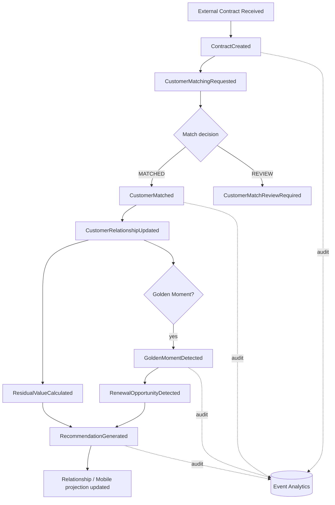

# Domain Event Map

## Main business flow



## Initial event catalog

### Customer

- `CustomerCreated`
- `CustomerUpdated`
- `CustomerMatched`
- `CustomerMatchReviewRequired`

### Vehicle

- `VehicleRegistered`
- `VehicleUpdated`

### Contract / Finance

- `ContractCreated`
- `ContractUpdated`
- `ContractActivated`
- `ContractEndApproaching`
- `ContractClosed`
- `PaymentScheduleUpdated`

### Engagement

- `ResidualValueCalculated`
- `GoldenMomentDetected`
- `RenewalOpportunityDetected`
- `RecommendationGenerated`
- `RecommendationViewed`
- `RecommendationAccepted`
- `RecommendationRejected`
- `NotificationRequested`
- `CustomerRelationshipUpdated`

## Event envelope baseline

Use CloudEvents 1.0 fields directly where practical, with correlation/causation metadata carried consistently.

```json
{
  "specversion": "1.0",
  "id": "evt-123",
  "type": "maya.finance.contract.updated.v1",
  "source": "/contract-service",
  "time": "2026-09-15T10:00:00Z",
  "subject": "contract/CON-100",
  "datacontenttype": "application/json",
  "correlationId": "corr-456",
  "causationId": "evt-122",
  "aggregateVersion": 7,
  "data": {}
}
```

Final AsyncAPI/schema form is an I5 deliverable.

## Delivery assumptions

The application design assumes at-least-once delivery unless a narrower feature is explicitly selected and proven. Therefore every state-changing consumer requires:

- stable `eventId`;
- aggregate/business key;
- idempotency store or transactional deduplication strategy;
- retry classification;
- dead-letter handling;
- controlled replay process;
- version/evolution rules.

## Duplicate scenario

Publish `ContractUpdated` twice with the same event ID/business effect. Expected business outcome: one logical state transition. The evidence directory will contain command output and state verification when implemented.

## Out-of-order scenario

If `ContractUpdated` arrives before the expected `ContractCreated`, consumers evaluate `aggregateVersion` and state. Policy options to be formalized by ADR/event governance: reject, defer, quarantine or replay; never silently overwrite newer state.
