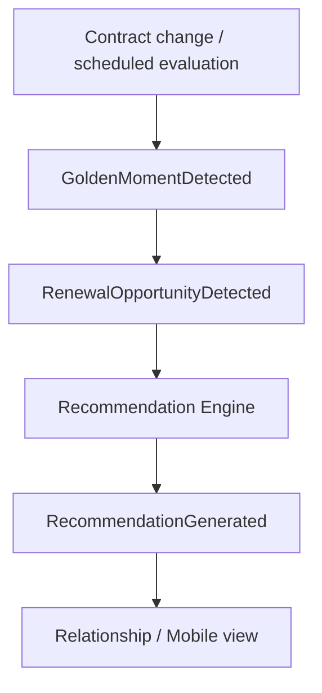

# Golden Moments, Renewal and Recommendation

## Golden Moments

Initial deterministic triggers:

- `CONTRACT_ANNIVERSARY`
- `LEASE_END_APPROACHING`
- `LOAN_END_APPROACHING`
- `HIGH_MILEAGE`
- `NEW_VEHICLE_ELIGIBILITY`
- `SERVICE_RENEWAL`

Thresholds are synthetic configuration. Current pure-Java baseline uses 120 days to contract end and 100,000 km for the demonstrator; these are not real-client business rules.

## Renewal flow

## Recommendation MVP

Deterministic rules keep the result explainable and testable:

- lease end approaching -> `VEHICLE_RENEWAL`;
- loan/finance end approaching -> `NEW_FINANCE_OFFER`;
- high mileage -> `LEASE_REVIEW`;
- missing service coverage can later produce `SERVICE_CONTRACT` when that source fact exists.

Scores in the POC are synthetic ranking values, not financial/credit scores.

## Residual value

`SYNTHETIC_V1` is deliberately simple and exists only to prove the pipeline:

`vehicle facts -> calculation -> ResidualValueCalculated -> recommendation consumer`.

No real depreciation model, market valuation or regulated financial advice is represented.
